# 【iOS10 Swift】 プッシュ通知を組み込もう！
*2016/09/27作成（2017/09/13更新）*

## 概要
* [ニフティクラウドmobile backend](http://mb.cloud.nifty.com/)の『プッシュ通知』機能を実装したサンプルプロジェクトです
* 簡単な操作ですぐに [ニフティクラウドmobile backend](http://mb.cloud.nifty.com/)の機能を体験いただけます★☆
* このサンプルはSwift3(iOS10)に対応しています
 * Swift2のサンプルは[こちら](https://github.com/natsumo/SwiftPushApp)

## ニフティクラウドmobile backendとは
スマートフォンアプリのバックエンド機能（プッシュ通知・データストア・会員管理・ファイルストア・SNS連携・位置情報検索・スクリプト）が**開発不要**、しかも基本**無料**(注1)で使えるクラウドサービス！

注1：詳しくは[こちら](http://mb.cloud.nifty.com/price.htm)をご覧ください

## 準備
### 準備するもの
* ニフティクラウド mobile backend 会員登録
  * 下記リンクより登録（無料）をお願いします http://mb.cloud.nifty.com/
* Mac と以下の環境
  * Xcode ver.8 以上推奨
* 動作確認用端末
  * iPhone ver.10 以上推奨
* Lightning ケーブル

<small>
#### 参考：検証済み動作環境
* macOS Sierra 10.12.5
* Xcode ver. 8.3.3
* iPhone 6+ ver. 10.0.1
  * このサンプルアプリは、実機ビルドが必要です
</small>

## プッシュ通知の仕組み
* ニフティクラウドmobile backendのプッシュ通知は、iOSが提供している通知サービスを利用しています
 * iOSの通知サービス　__APNs（Apple Push Notification Service）__

* 上図のように、アプリ（Xcode）・サーバー（ニフティクラウドmobile backend）・通知サービス（APNs）の間でやり取りを行うため、認証が必要になります
 * 認証に必要な鍵や証明書の作成は作業手順の「0.プッシュ通知機能使うための準備」で行います

## 作業の手順
### 0.プッシュ通知機能使うための準備
__[【iOS】プッシュ通知の受信に必要な証明書の作り方(開発用)](https://github.com/natsumo/iOS_Certificate)__
* 上記のドキュメントをご覧の上、必要な証明書類の作成をお願いします
 * 証明書の作成には[Apple Developer Program](https://developer.apple.com/account/)の登録（有料）が必要です

### 1. ニフティクラウド mobile backend の準備
* ニフティクラウド mobile backend にログインします http://mb.cloud.nifty.com/

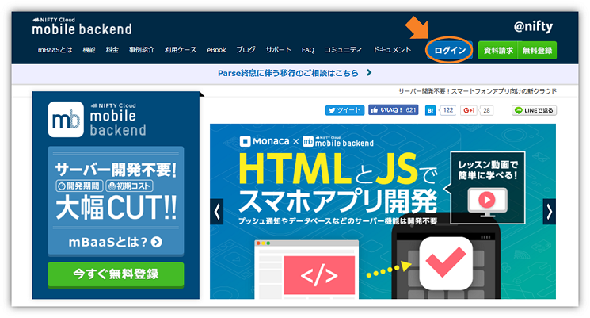

* 新しいアプリを作成します
* アプリ名を入力し、「新規作成」をクリックします
  * 例）__PushDemo__

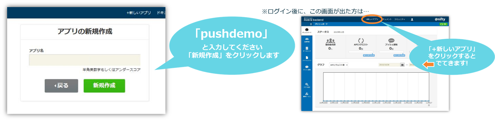

* mobile backend を既に使用したことがある場合は、画面上方のメニューバーにある「+新しいアプリ」をクリックすると同じ画面が表示されます

* アプリ作成されると下図のような画面になります
* この２種類のAPIキー（アプリケーションキーとクライアントキー）はこの後 iOSアプリ との連携のために使用します

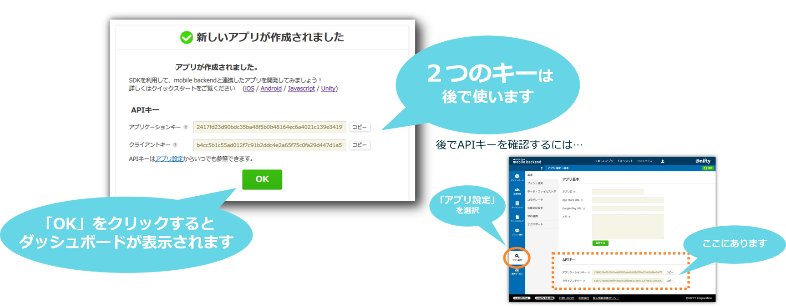

* 続けてプッシュ通知の設定を行います
* 「APNs用証明書(.p12)」を設定します

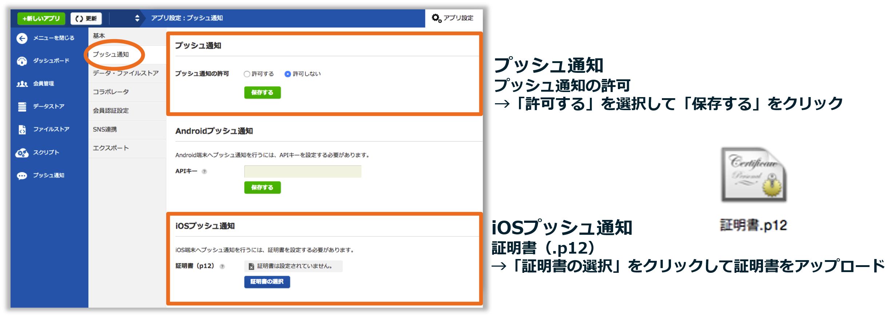

### 2. サンプルプロジェクトのダウンロード

* 下記リンクからプロジェクトをMacにダウンロードします  https://github.com/natsumo/Swift3PushApp/archive/master.zip

### 3. Xcodeでアプリを起動

* ダウンロードしたフォルダを開き、「__Swift3PushApp.xcworkspace__」をダブルクリックしてXcode開きます(白い方です)
  * 「Swift3PushApp.xcodeproj」（青い方）ではないので注意！

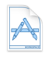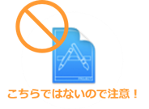

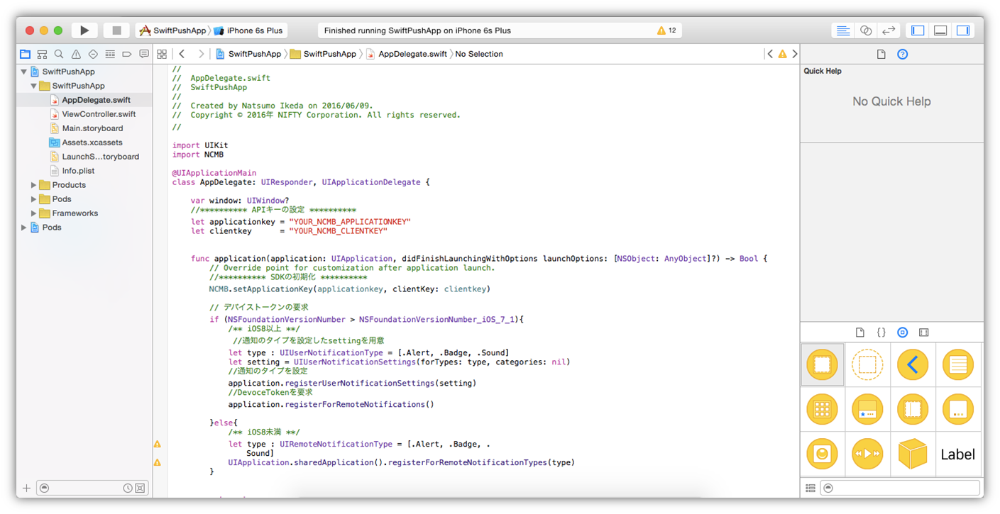

### 4. APIキーの設定

* `AppDelegate.swift`を編集します
* 先程ニフティクラウド mobile backend のダッシュボード上で確認したAPIキーを貼り付けます

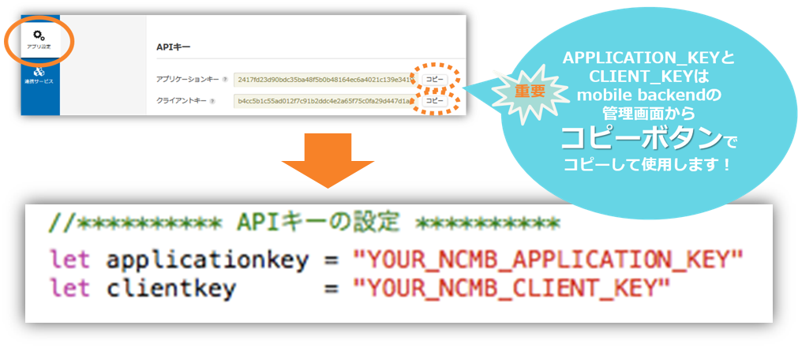

* それぞれ `YOUR_NCMB_APPLICATION_KEY` と `YOUR_NCMB_CLIENT_KEY` の部分を書き換えます
 * このとき、ダブルクォーテーション（`"`）を消さないように注意してください！
* 書き換え終わったら`command + s`キーで保存をします

### 5. 実機ビルド
* 始めて実機ビルドをする場合は、Xcodeにアカウント（AppleID）の登録をします
* メニューバーの「Xcode」＞「Preferences...」を選択します
* Accounts画面が開いたら、左下の「＋」をクリックします。
* Apple IDとPasswordを入力して、「Add」をクリックします

* 追加されると、下図のようになります
  * 追加した情報があっていればOKです

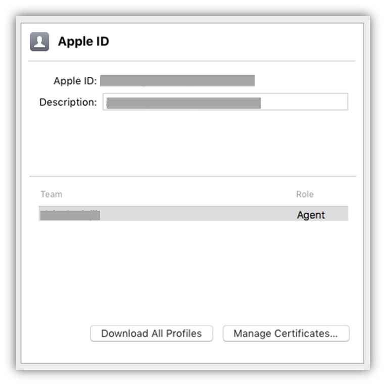

* 確認できたら閉じます
* 次に「TARGETS」 ＞「General」を開きます

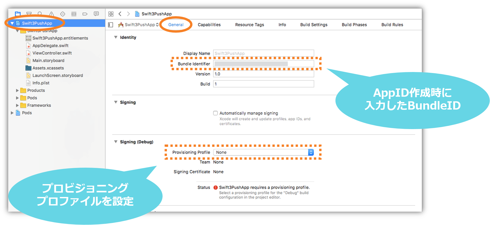

* 「Idenrity」＞「Bundle Identifier」を入力します
* 「Bundle Identifier」には AppID 作成時に指定した「Bundle ID」を入力してください

* 続けて「Signing(Debug)」＞「Provisioning Profile」を設定します
* 使用するプロビジョニングプロファイルをプルダウンから選択します
  * プロビジョニングプロファイルはダウンロードしたものを一度 __ダブルクリック__ して認識させておく必要があります（プルダウンに表示されない場合はダブルクリックを実施後設定してください）
* 選択すると以下のようになります

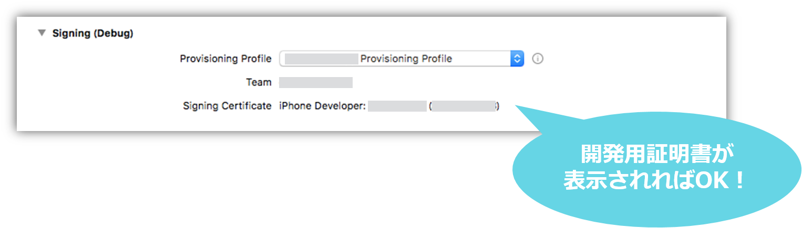

* 最後に「TARGETS」＞「Capabilities」を開き、「Push Notifications」を __ON__ に設定します
* 設定すると以下のようになります

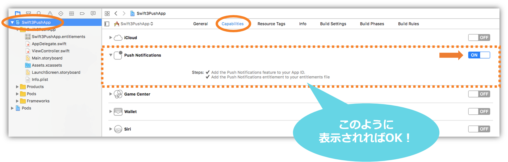

* これで準備は完了です

### 6.動作確認
* lightningケーブルで登録した動作確認用iPhoneをMacにつなぎます
* Xcode画面で左上で、接続したiPhoneを選び、実行ボタン（さんかくの再生マーク）をクリックすると端末にアプリがインストールされます
* インストールしたアプリを起動します
  * __注意__：プッシュ通知の許可を求めるアラートが出たら、必ず許可してください！
* 起動されたらこの時点でデバイストークンが取得されます
* ニフティクラウド mobile backend のダッシュボードで「データストア」＞「installation」クラスを確認してみましょう！

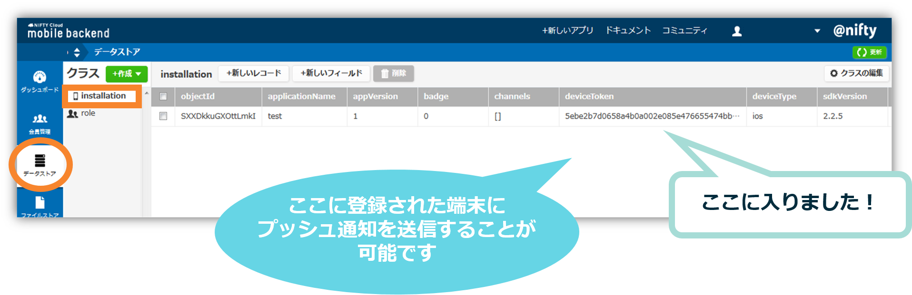

* ここで端末側で起動したアプリは一度閉じておきます

### 7. プッシュ通知を送りましょう！
* いよいよです！実際にプッシュ通知を送ってみましょう！
* ニフティクラウド mobile backend のダッシュボードで「プッシュ通知」＞「＋新しいプッシュ通知」をクリックします
* プッシュ通知のフォームが開かれます
* 必要な項目を入力してプッシュ通知を作成します

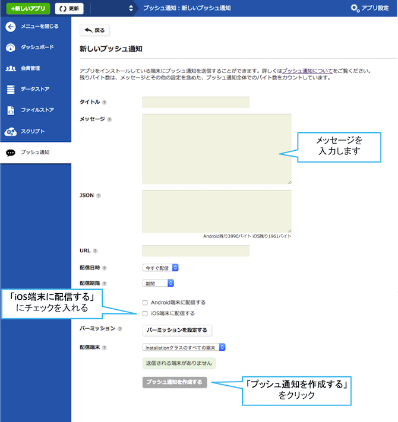

* 端末を確認しましょう！

* 少し待つとプッシュ通知が届きます！！！

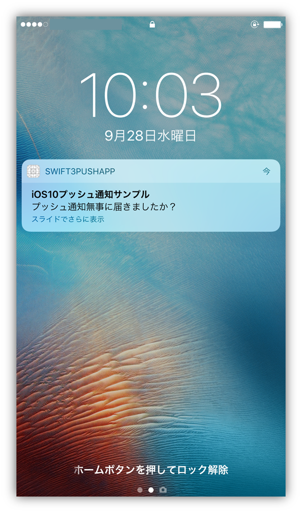

## 解説
サンプルプロジェクトに実装済みの内容のご紹介

#### SDKのインポートと初期設定
* ニフティクラウド mobile backend の[ドキュメント（クイックスタート）](http://mb.cloud.nifty.com/doc/current/introduction/quickstart_ios.html)をSwift版に書き換えたドキュメントをご用意していますので、ご活用ください
 * [SwiftでmBaaSを始めよう！(＜CocoaPods＞でuse_framewoks!を有効にした方法)](http://qiita.com/natsumo/items/57d3a4d9be16b0490965)

#### ロジック
* `AppDelegate.swift`の`didFinishLaunchingWithOptions`メソッド内に、「APNsに対してデバイストークンを要求するコード」を記述しています
  * デバイストークンの要求はiOSのバージョンによってコードが異なるため、場合分けして記述しています

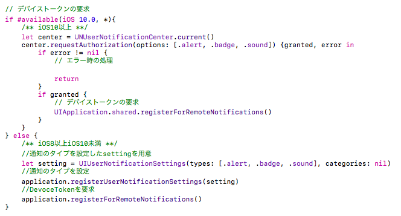

* デバイストークン取得後、`didRegisterForRemoteNotificationsWithDeviceToken`メソッドが呼ばれ、取得したデバイストークンをニフティクラウド mobile backend 上に保存しています

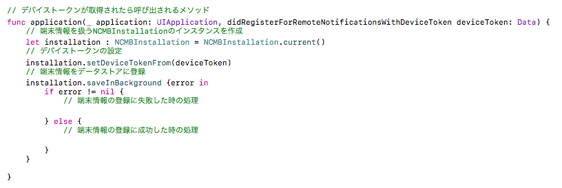

